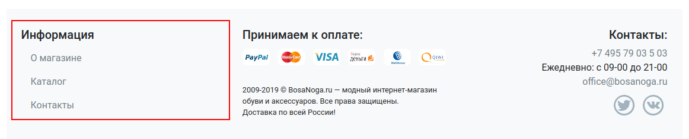
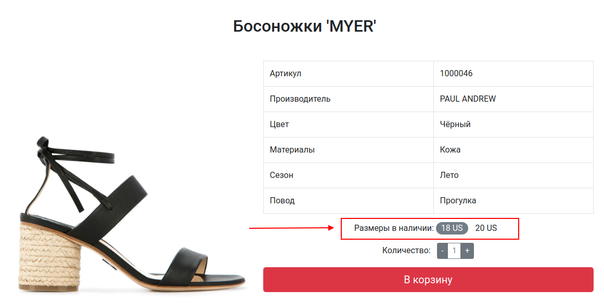
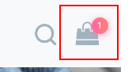

# Shoe Store

<h3 align="center"><a href="https://shoe-store-asotikovasvetlana.vercel.app/" target="_blank">Demo</a></h3>

Интернет-магазин обуви. Задача заключалась в создании работающего приложения, всеми основными функциями которого можно пользоваться.

Для хранения состояния корзины и побочных эффектов используется: Redux + Redux Thunk.

Для эмуляции проблем с интернет-соединением на сервере выполняется генерация задержки и ошибки:

```js
const fortune = (ctx, body = null, status = 200) => {
  // Uncomment for delay
  const delay = randomNumber(1, 10) * 1000;

  return new Promise((resolve, reject) => {
    setTimeout(() => {
      // Uncomment for error generation
      if (Math.random() > 0.8) {
        reject(new Error("Something bad happened"));
        return;
      }

      ctx.response.status = status;
      ctx.response.body = body;
      resolve();
    }, delay);
  });
};
```

## Содержание

Приложение содержит следующие самостоятельные экраны (страницы):

1. Главная страница
1. Каталог товаров
1. Информационная страница
1. Страница товара
1. Корзина
1. 404

## Переходы между экранами

Навигационным центром приложения являются шапка и футер каждого экрана (страницы):




Из шапки можно попасть на следующие экраны:

- Логотип и ссылка "Главная" - ведут на главную страницу, URL - "/"
- Каталог - ведёт на страницу каталога, URL - "/catalog.html"
- О магазине - ведёт на страницу "О магазине", URL - "/about.html"
- Контакты - ведёт на страницу "Контакты", URL - "/contacts.html"

Из футера можно попасть на следующие экраны:

- О магазине - ведёт на страницу "О магазине", URL - "/about.html"
- Каталог - ведёт на страницу каталога, URL - "/catalog.html"
- Контакты - ведёт на страницу "Контакты", URL - "/contacts.html"

## Описание экранов

### Главная страница

Экран «Главная страница» доступен по умолчанию при открытии приложения.


При загрузке любых данных с помощью сетевых запросов отображается лоадер.
После загрузки страница выглядит следующим образом:


Компоненты:

1. Хиты продаж - GET /api/top-sales. Если в ответе приходит пустой массив (т.е. хитов продаж нет), то компонент ничего не отображает и не занимает места на экране.

1. Категории каталога - GET /api/categories. Выбранный элемент служит для определения того, какие будут загружаться товары из каталога (т.е. "Все" - загружаются все, "Женская обувь" - загружается только женская обувь). Активный элемент выделен. При смене категории делается новый запрос, предыдущие загруженные данные удаляются.

1. Элементы каталога - GET /api/items?categoryId=X. Возвращается массив элементов, соответствующих запросу.

1. Загрузить ещё - при нажатии на "Загрузить ещё" загружаются ещё 6 элементов: GET /api/items?offset=X (где `offset` определяет сколько элементов пропустить). Если сервер вернул пустой массив или меньше 6 элементов, то кнопка "Загрузить ещё" скрывается На время загрузки показывается лоадер, сама кнопка скрывается. При загрузке учитывается выбранная категория: т.е. если выбрана категория "Женская обувь", то при нажатии на "Загрузить ещё" делается запрос GET /api/items?categoryId=X&offset=X (и т.д.)

### Каталог товаров

Экран «Каталог товаров»:


Фактически, он полностью повторяет функциональность каталога на главной странице, за одним исключением: у него есть поле поиска.

При заполнении этого поля отправляется запрос вида: GET /api/items?q=<текст в строке поиска>. При этом все правила относительно категории, кнопки "Загрузить ещё" сохраняются. Если категория меняется, то данные перезагружаются с учётом строки поиска. Строка поиска реагирует только на полный ввод (не live-поиск).

### Поиск

На всех страницах в шапке присутствует виджет поиска:


По умолчанию поисковое поле скрыто, отображается только иконка:


Эта иконка работает следующим образом: при первом клике открывает строку поиска, при втором - если был введён какой-то текст, то перенаправляет пользователя на страницу каталога, при этом в поисковом поле должен быть отображён тот же текст, что был ввёден в строку поиска в шапке (и загрузка данных должна происходить исходя из этого):


### О магазине, Контакты

Просто контентные страницы. Никакой логики (кроме работы виджета поиска и ссылок) нет.

### Страница товара

Страница товара выглядит следующим образом:


Страница открывается при нажатии кнопки "Заказать" в карточках товаров. URL - /catalog/:id, где id - это id товара.

Блок самого товара:



Ключевые моменты:

1. При загрузке показывается лоадер.
1. Для загрузки полной информации о товаре: GET /api/items/:id, где id - это id товара.
1. Слева выводится картинка.
1. Сбоку выводится табличка с данными, если каких-то данных в приходящем товаре нет, поле остается пустым.
1. Размеры - выводятся все доступные размеры (у которых флаг `available` равен `true`). По умолчанию ни один размер не выбран. После выбора он становится выделенным, как на скриншоте. Кнопка "В корзину" активируется только тогда, когда есть размеры в наличии и выбран конкретный размер. Размер можно выбрать только один.
1. Количество - от 1 до 10.

Если ни одного размера не доступно, блок с количеством и кнопка "В корзину" не отображаются.

### Страница корзины

В корзину можно попасть, кликнув на иконку корзины в шапке сайта.

Корзина выглядит следующим образом:


Блок корзина - отображает количество товаров, находящихся в корзине. Все товары хранятся локально в localStorage. Товар можно удалить из корзины (удалится и из localStorage тоже).

Одной позицией в табличке считается пара - Товар + Размер. Общая сумма расчитывается на базе суммирования всех позиций при отображении.

Соответственно, виджет отображает количество позиций в корзине:



Если в корзине товаров нет вообще, розовый индикатор не отображается.

Блок оформления заказа позволяет оформить заказ - POST /api/order. В теле - JSON:

```json
{
  "owner": {
    "phone": "+7xxxxxxxxxxx",
    "address": "Moscow City"
  },
  "items": [
    {
      "id": 1,
      "price": 34000,
      "count": 1
    }
  ]
}
```

После успешного оформления заказа все данные корзины удаляются из state и localStorage.

### 404

При вводе несуществующего url'а, пользователю показывается страница 404.
